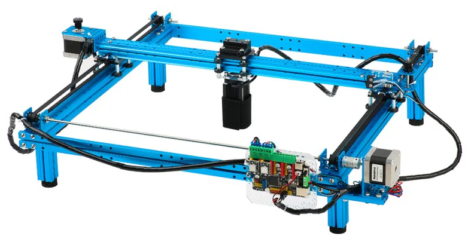
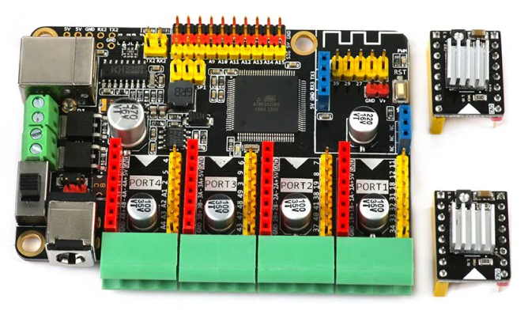

	<table>
	  <tr>
	    <td width="33%" align="center">
	      
	    </td>
	    <td width="33%" align="center">
	      
	    </td>
       <td width="33%" align="center">
	      
	    </td>
	  </tr>
	</table>

# grbl-MegaPi (Makeblock LaserBot Firmware)

**Latest stable for LaserBot:** https://github.com/porrey/grbl-MegaPi/releases/latest

## How to upgrade (quick path)

1. Open the latest stable release:
   - https://github.com/porrey/grbl-MegaPi/releases/latest
2. Download source ZIP, then install the `grbl` folder as an Arduino library.
   - Arduino IDE: **Sketch > Include Library > Add .ZIP Library...**
3. Open **File > Examples > grbl > grblUpload**.
4. Select **Arduino Mega or Mega 2560** and upload to your MegaPi.

> Planned distribution path: Arduino Library Manager support (see `doc/markdown/distribution.md` for submission/release steps).

This repository is a Grbl-Mega fork configured for the **Makeblock LaserBot** and its **MegaPi (ATmega2560)** controller.

The goal is to replace the original legacy firmware/software stack with a standard Grbl workflow so the LaserBot can be used with modern software like **LightBurn**.

> Base Grbl-Mega documentation is available here:  
> https://github.com/gnea/grbl-Mega/blob/edge/README.md

## Makeblock LaserBot + MegaPi

### LaserBot

The Makeblock LaserBot is a 2-axis laser engraver/cutter platform. In this firmware:

- X/Y motion is fully supported with LaserBot pin mapping.
- Laser power uses Grbl spindle/laser control (`M3`, `M4`, `M5`, `S` values).
- Homing and limit behavior are configured for LaserBot endstops.

### MegaPi board

The MegaPi is based on the **ATmega2560**, so it can be programmed directly from the Arduino IDE as an Arduino Mega-class target.

This fork includes a dedicated MegaPi board map and LaserBot defaults:

- `DEFAULTS_MEGAPI_LASERBOT` enabled in `grbl/config.h`
- `CPU_MAP_2560_MEGAPI_BOARD` enabled in `grbl/config.h`
- LaserBot-specific pin map in `grbl/cpu_map.h`
- LaserBot driver/limits/laser PWM handling in `grbl/megapi.c`

## LaserBot defaults in this firmware

Key machine defaults compiled into this build include:

- Baud: **230400**
- Work area defaults: **X 340 mm**, **Y 360 mm**
- Laser mode enabled by default (`$32=1`)
- Homing enabled by default (`$22=1`)
- PWM range aligned for LaserBot laser control (`S0` to `S255`)

These come from the `DEFAULTS_MEGAPI_LASERBOT` profile in `grbl/defaults.h`.

## Build and flash firmware with Arduino IDE

The LaserBot uses the standard Arduino upload workflow.

### 1) Download this firmware

Either:

- Clone:
  - `git clone https://github.com/porrey/grbl-MegaPi.git`
- Or download ZIP from GitHub and extract it.

### 2) Install the Grbl library into Arduino IDE

1. Copy the repository's `grbl` folder into your Arduino libraries folder.
   - Typical location: `Documents/Arduino/libraries/grbl`
2. Restart Arduino IDE.

### 3) Open the upload sketch

In Arduino IDE:

1. Open **File > Examples > grbl > grblUpload**
2. This loads: `grbl/examples/grblUpload/grblUpload.ino`

### 4) Select board and port

In **Tools**:

- **Board**: `Arduino Mega or Mega 2560`
- **Processor**: `ATmega2560` (if shown)
- **Port**: Select the LaserBot serial port

### 5) Flash firmware

Click the standard **Upload** button in Arduino IDE.

That is all that is required to flash the LaserBot.

## LightBurn setup

After firmware upload, configure LightBurn with the provided device profile.

### 1) Download and install LightBurn

Get LightBurn from: https://lightburnsoftware.com

### 2) Import the LaserBot device profile

1. Open LightBurn.
2. Go to **Devices**.
3. Click **Import**.
4. Select:
   - `LightBurn/Laserbot.lbzip`
5. Finish the import wizard and connect to the LaserBot serial port.

The `Laserbot.lbzip` profile includes the key connection and machine parameters needed for this firmware.

### 3) Open included sample jobs

This repository includes LightBurn samples in `LightBurn/`:

1. **`Cut-Test.lbrn2`**  
   20 cm x 20 cm cut test pattern.
2. **`Test.lbrn2`**  
   Text engraving test file.
3. **`mando.lbrn2`**  
   Image etching example.

## LaserGRBL setup

You can also run this firmware with LaserGRBL instead of LightBurn.

### 1) Download and install LaserGRBL

Download from: https://lasergrbl.com

### 2) Connect to the LaserBot

1. Start LaserGRBL.
2. Select the LaserBot COM port.
3. Set baud rate to **230400**.
4. Click **Connect**.

### 3) Configure machine profile/settings

Use these baseline values for this firmware:

- Controller type: **Grbl**
- Work area: **X 340 mm**, **Y 360 mm**
- Laser mode enabled: `$32=1`

Optional but recommended:

- Home the machine (`$H`) before jobs.

## Enable Soft Limits (optional)
### Enable soft limits (`$20=1`) in LightBurn

Soft limits are **disabled by default** in this firmware (`$20=0`), so enable them after setup if you want Grbl to alarm on out-of-range moves.

1. Connect to the LaserBot in LightBurn.
2. Open the **Console** panel.
3. Send:
   - `$20=1`
4. Confirm by sending `$$` and checking that `$20=1` is reported.

Soft limits require homing and valid travel settings (`$130`, `$131`).

### Enable soft limits (`$20=1`) from Arduino IDE

You can set the same option from Arduino IDE using Serial Monitor.

1. Open **Tools > Serial Monitor**.
2. Set line ending to **Newline** and baud to **230400**.
3. Send:
   - `$20=1`
4. Send `$$` to verify that `$20=1` is saved.

Soft limits are stored in Grbl settings, so this only needs to be done once per controller reset/config reset workflow.

### Enable soft limits (`$20=1`) in LaserGRBL

You can also enable soft limits directly from LaserGRBL.

1. Connect to the LaserBot in LaserGRBL.
2. Open the **Console** area.
3. Send:
   - `$20=1`
4. Send `$$` and confirm `$20=1` is shown in the settings list.

Soft limits require homing and valid travel settings (`$130`, `$131`).

## Machine travel limits and 5 mm safety buffer

This firmware is configured with a 5 mm safety buffer on each axis:

- `$130=340` (X travel)
- `$131=360` (Y travel)

The machine can physically travel to about **X=345** and **Y=365**, but the configured values intentionally stop 5 mm short to reduce overtravel risk.

### Set and verify travel limits (`$130`, `$131`) in LightBurn and LaserGRBL
If you want to expand the limits and remove the 5 mm safetly buffer on each axis, you can reconfigure the settings using the serial interface through the software or the Arduino IDE.

1. Connect to the controller.
2. Send:
   - `$130=345`
   - `$131=365`
3. Send `$$` and verify `$130` and `$131`.

### Update software work area after changing travel limits
If you change the firmware limit settings the software will need to be updated too.
- **LightBurn**: Open **Device Settings** and set work area to **X 345 mm / Y 366 mm** (or your chosen values), then save.
- **LaserGRBL**: Open machine profile/settings and set work area to **X 345 mm / Y 365 mm** (or your chosen values), then save.

## LaserBot support summary (what this fork changes)

This fork adds and enables the pieces needed to run a Makeblock LaserBot as a Grbl laser machine:

1. **LaserBot/MegaPi build profile enabled**
   - `grbl/config.h` enables MegaPi CPU map and LaserBot defaults.
2. **LaserBot hardware pin mapping**
   - `grbl/cpu_map.h` defines LaserBot motion, enable, endstop, and laser PWM pins.
3. **MegaPi board-specific runtime support**
   - `grbl/megapi.c` initializes drivers, reads LaserBot limits, and controls laser PWM behavior.
4. **Laser-oriented defaults**
   - `grbl/defaults.h` sets machine travel, speeds, homing, baud, and laser mode defaults for LaserBot.
5. **Laser command behavior compatibility**
   - Laser power behavior is adapted for MegaPi/LaserBot handling in core motion/spindle flow.

Together, these changes modernize the LaserBot workflow and allow practical use with current host software, especially LightBurn.

## Maintainer discoverability checklist

Repository settings that should be configured on GitHub:

- **Description**: `Makeblock LaserBot firmware upgrade for MegaPi using Grbl + LightBurn workflow`
- **Topics**: `laserbot`, `makeblock`, `megapi`, `grbl`, `firmware`, `lightburn`

See also:

- Release/submission workflow: `doc/markdown/distribution.md`
- Community announcement templates: `doc/markdown/community_announcement.md`
